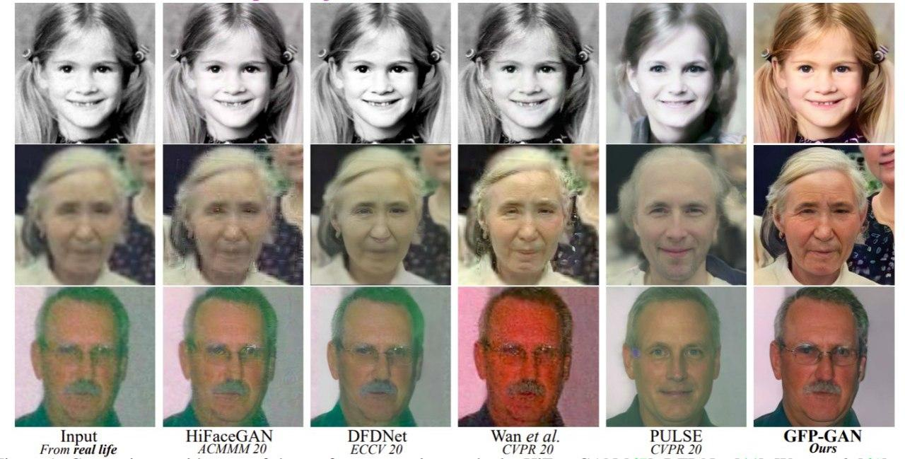

# Awesome Face Restoration
A curated list of recources (papers, repositories etc.) about face restoration / face hallucination methods / face super-resolution methods. Feel free to contribute to this list.

# What is face restoration and face hallucination?
Face hallucination refers to any super-resolution technique which applies specifically to faces. It comprises techniques which take noisy or low-resolution facial images, and convert them into high-resolution images using knowledge about typical facial features. [From Wikipedia.](https://en.wikipedia.org/wiki/Face_hallucination)

## 2022 Papers
| Model name | Paper | Code
| ----------- | ----------- | ----------- |
| CodeFormer | [Towards Robust Blind Face Restoration with Codebook Lookup Transformer](https://arxiv.org/abs/2206.11253) | https://github.com/sczhou/CodeFormer
| GCFSR | [GCFSR: a Generative and Controllable Face Super Resolution Method Without Facial and GAN Priors](https://arxiv.org/abs/2203.07319) | https://github.com/hejingwenhejingwen/GCFSR
| VQFR | [VQFR: Blind Face Restoration with Vector-Quantized Dictionary and Parallel Decoder](https://arxiv.org/abs/2205.06803) | https://github.com/TencentARC/VQFR
| Panini-Net | [Panini-Net: GAN Prior based Degradation-Aware Feature Interpolation for Face Restoration](https://arxiv.org/pdf/2203.08444.pdf) | https://github.com/jianzhangcs/panini

## 2021 Papers
| Model name | Paper | Code
| ----------- | ----------- | ----------- |
| GFPGAN | [Towards Real-World Blind Face Restoration with Generative Facial Prior](https://arxiv.org/abs/2101.04061) | https://github.com/TencentARC/GFPGAN
| GPEN | [GAN Prior Embedded Network for Blind Face Restoration in the Wild](https://arxiv.org/abs/2105.06070) | https://github.com/yangxy/GPEN
| PSFR-GAN | [Progressive Semantic-Aware Style Transformation for Blind Face Restoration](https://arxiv.org/abs/2009.08709) | https://github.com/chaofengc/PSFRGAN
| pixel2style2pixel (pSp) | [Encoding in Style: a StyleGAN Encoder for Image-to-Image Translation](https://arxiv.org/abs/2008.00951) | https://github.com/eladrich/pixel2style2pixel

## 2020 Papers
| Model name | Paper | Code
| ----------- | ----------- | ----------- |
| DFDNet | [Blind Face Restoration via Deep Multi-scale Component Dictionaries](https://arxiv.org/pdf/2008.00418.pdf) | https://github.com/csxmli2016/DFDNet 
| PULSE | [PULSE: Self-Supervised Photo Upsampling via Latent Space Exploration of Generative Models](https://arxiv.org/pdf/2003.03808.pdf) | https://github.com/adamian98/pulse
| HiFaceGAN | [HiFaceGAN: Face Renovation via Collaborative Suppression and Replenishment](https://arxiv.org/abs/2005.05005) | https://github.com/Lotayou/Face-Renovation
| mGANprior | [Image Processing Using Multi-Code GAN Prior](https://arxiv.org/abs/1912.07116) | https://github.com/genforce/mganprior
| UMSN-Face-Deblurring | [Deblurring Face Images using Uncertainty Guided Multi-Stream Semantic Networks](https://arxiv.org/pdf/1907.13106.pdf) | https://github.com/rajeevyasarla/UMSN-Face-Deblurring

## 2019 Papers
| Model name | Paper | Code
| ----------- | ----------- | ----------- |
| GWAInet | [Exemplar Guided Face Image Super-Resolution without Facial Landmarks](https://openaccess.thecvf.com/content_CVPRW_2019/papers/NTIRE/Dogan_Exemplar_Guided_Face_Image_Super-Resolution_Without_Facial_Landmarks_CVPRW_2019_paper.pdf) | https://github.com/berkdogan2/GWAInet

## 2018 Papers
| Model name | Paper | Code
| ----------- | ----------- | ----------- |
| GFRNet | [Learning Warped Guidance for Blind Face Restoration](https://arxiv.org/abs/1804.04829) | https://github.com/csxmli2016/GFRNet

## 2017 Papers
| Model name | Paper | Code
| ----------- | ----------- | ----------- |
| Super-FAN | [Super-FAN: Integrated facial landmark localization and super-resolution of real-world low resolution faces in arbitrary poses with GANs](https://openaccess.thecvf.com/content_cvpr_2018/papers/Bulat_Super-FAN_Integrated_Facial_CVPR_2018_paper.pdf) | https://github.com/jzijin/Super-FAN
| Wavelet-srnet | [Wavelet-srnet: A wavelet-based cnn for multi-scale face super resolution](https://openaccess.thecvf.com/content_iccv_2017/html/Huang_Wavelet-SRNet_A_Wavelet-Based_ICCV_2017_paper.html) | https://github.com/hhb072/WaveletSRNet

# Paperswithcode links
* [Image super-resolution](https://paperswithcode.com/task/image-super-resolution)
* [Face hallucination](https://paperswithcode.com/task/face-hallucination)
* [Blind face restoration](https://paperswithcode.com/task/blind-face-restoration)

# Similiar resources
* [Face-Hallucination-Benchmark](https://github.com/junjun-jiang/Face-Hallucination-Benchmark)

Image source: [Towards Real-World Blind Face Restoration with Generative Facial Prior](https://arxiv.org/abs/2101.04061)
